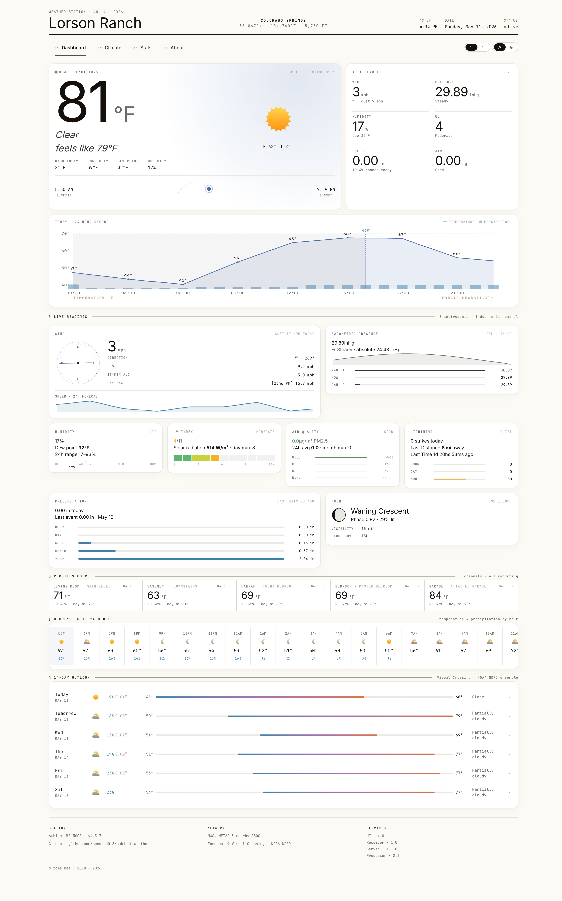

# Ambient Weather

A custom system to receive, process, and display weather data from an Ambient Weather PWS. View a live example at [https://weather.zoms.net](https://weather.zoms.net)



---

## Architecture Overview

The system is made up of several services that work together in a pipeline. Data flows from your weather station through MQTT into the database, and is served to the UI via the API server.

### Option A — Station Console (AWNet / Custom Server)

```
[Weather Station Console]
        ↓
    [Receiver]  ← receives HTTP push from AWNet app
        ↓
   [MQTT Broker]
        ↓
   [Processor]  ← reads MQTT, calculates, writes to PostgreSQL
        ↓
   [MQTT Broker]  ← processor publishes "run stats" message
        ↓
     [Stats]   ← runs statistical calculations, writes to PostgreSQL
        ↓
    [Server]   ← REST API for the UI
        ↓
      [UI]
```

The **Receiver** accepts incoming data pushes from the AWNet application's custom server option and publishes them to MQTT. The **Console Processor** subscribes to MQTT, performs calculations, and persists data to PostgreSQL. It then publishes a trigger message that tells **Stats** to run. **Server** is the API backend for the **UI**.

### Option B — RTL-SDR (Direct RF Reception)

```
[Weather Station RF]
        ↓
  [RTL-SDR + rtl_433]  ← receives 915MHz signal, publishes directly to MQTT
        ↓
   [MQTT Broker]
        ↓
  [mqtt_processor]  ← reads MQTT, writes to PostgreSQL
        ↓
   [MQTT Broker]  ← processor publishes "run stats" message
        ↓
     [Stats]   ← runs statistical calculations, writes to PostgreSQL
        ↓
    [Server]   ← REST API for the UI
        ↓
      [UI]
```

With RTL-SDR, `rtl_433` handles reception and publishes directly to MQTT — no Receiver service is needed. The **Processor** takes data from MQTT and writes it to the database.

---

## Prerequisites

The following external services are required regardless of which data source option you choose:

- **MQTT Broker** (e.g. Mosquitto) — message bus between components
- **PostgreSQL** — database for weather data and statistics
- **Visual Crossing API key** — for forecast data ([https://www.visualcrossing.com/](https://www.visualcrossing.com/))

For **Option B (RTL-SDR)** only:
- An RTL-SDR USB dongle
- [`rtl_433`](https://github.com/merbanan/rtl_433) installed on the host

---

## 1. Database Setup

Create the database and user in PostgreSQL:

```sql
CREATE DATABASE ambient;
CREATE USER ambient WITH PASSWORD 'yourpassword';
GRANT ALL PRIVILEGES ON DATABASE ambient TO ambient;
```

Then apply the schema:

```bash
psql -U ambient -d ambient -f schema.sql
```

If you have existing data to migrate, also apply:

```bash
psql -U ambient -d ambient -f migration.sql
```

---

## 2. Environment Configuration

Copy `sample.env` to `.env` and fill in your values:

```bash
cp sample.env .env
```

```env
PORT=6000
DB_HOST=<your-postgres-host>
DB_USER=ambient
DB_PASSWORD=<your-db-password>
DB_DATABASE=ambient
ALERT_CRON="*/15 * * * *"
LAT=<your-latitude>
LON=<your-longitude>
LOGLEVEL=Info
WEATHER_API=<your-visual-crossing-api-key>
```

Then update the environment variables in `docker-compose.yml` with your specific values (database host, MQTT broker address, credentials, station MAC, elevation, coordinates, etc.).

---

## 3. Option A Setup — Station Console (AWNet)

### Configure AWNet

In the AWNet application on your mobile device, set the custom server option:

| Field | Value |
|---|---|
| Enable Data Push | Enabled |
| Server IP / Hostname | IP of the host running the `receiver` container |
| Path | `/api/receiver?` |
| Port | `7500` (or the value of `TRANSFER_PORT` in docker-compose.yml) |
| Upload Interval | 60–300 seconds (60 seconds minimum recommended) |

Save the settings and monitor the receiver container logs to confirm data is arriving.

### Services Used (Option A)

- `receiver` — accepts AWNet HTTP push, publishes to MQTT
- `processor` — reads MQTT, calculates, saves to PostgreSQL, triggers stats
- `stats` — runs on MQTT trigger, computes statistics
- `server` — REST API backend
- `ui` — web frontend

---

## 4. Option B Setup — RTL-SDR

### Install rtl_433

Install `rtl_433` on the host machine that has the RTL-SDR dongle attached. See [https://github.com/merbanan/rtl_433](https://github.com/merbanan/rtl_433) for installation instructions.

### Configure rtl_433 as a Service

Create a systemd service (or equivalent) with the following `ExecStart`:

```
/usr/bin/rtl_433 -f 915M -Y classic -M level -F json -F "mqtt://<host>:1883,user=<user>,pass=<pass>,retain=0,events=ambient[/model][/id]"
```

Replace `<host>`, `<user>`, and `<pass>` with your MQTT broker's host address and credentials. This will tune to 915 MHz, decode incoming station packets, and publish them directly to your MQTT broker under the `ambient/<model>/<id>` topic hierarchy.

### Services Used (Option B)

- `mqtt_processor` — reads MQTT topics published by rtl_433, writes to PostgreSQL, triggers stats
- `stats` — runs on MQTT trigger, computes statistics
- `server` — REST API backend
- `ui` — web frontend

---

## 5. Build Docker Containers

For each service you need to build and push to your own Docker registry.

### UI

```bash
cd ui
docker build -t $DOCKER_REGISTRY/weather/weather-ui:v3.2.1 . --no-cache
docker push $DOCKER_REGISTRY/weather/weather-ui:v3.2.1
```

### Server

```bash
cd server
docker build -t $DOCKER_REGISTRY/weather/weather-server:v5.0.1 . --no-cache
docker push $DOCKER_REGISTRY/weather/weather-server:v5.0.1
```

### Processor

```bash
cd processor
docker build -t $DOCKER_REGISTRY/weather/processor:v3.0.0 . --no-cache
docker push $DOCKER_REGISTRY/weather/processor:v3.0.0
```

### mqtt_processor (RTL-SDR only)

```bash
cd mqtt_processor
docker build -t $DOCKER_REGISTRY/weather/mqtt-processor:v1.0.0 . --no-cache
docker push $DOCKER_REGISTRY/weather/mqtt-processor:v1.0.0
```

### Stats

```bash
cd stats
docker build -t $DOCKER_REGISTRY/weather/stats:v1.0.0 . --no-cache
docker push $DOCKER_REGISTRY/weather/stats:v1.0.0
```

### Receiver (Console/AWNet only)

```bash
cd receiver
docker build -t $DOCKER_REGISTRY/weather/receiver:v2.1.2 . --no-cache
docker push $DOCKER_REGISTRY/weather/receiver:v2.1.2
```

Update the image names in `docker-compose.yml` to match your registry paths and chosen versions.

---

## 6. Nginx Setup

Update the `nginx.conf` file with your domain name or IP address. Set the `weather_upstream` server directive to point to the host where `weather-server` is running.

---

## 7. Forecast API

The forecast API in the server pulls data from **Visual Crossing** (`vcforecast`), not the local forecast database table. Ensure the `WEATHER_API` environment variable is set to a valid Visual Crossing API key in both the `docker-compose.yml` and your `.env` file.

---

## 8. Update Location Information

Update the following in `docker-compose.yml`:
- `LAT` and `LON` — your station's coordinates
- `ELEVATION` — your station's elevation in meters

Also update the display name, short name, state, and country values in `ui/src/Context.tsx` to reflect your location.

---

## Starting the Application

From the directory containing `docker-compose.yml`:

```bash
# Start all services
docker-compose up -d

# Stop all services
docker-compose down

# View logs for a specific service
docker-compose logs -f server
docker-compose logs -f processor
```

---

## Repository Structure

```
ambient-weather/
├── receiver/        # AWNet custom server HTTP receiver (Option A)
├── processor/       # MQTT consumer + data processor (Option A)
├── mqtt_processor/  # MQTT consumer + data processor (Option B / RTL-SDR)
├── stats/           # Statistical calculations service
├── server/          # REST API backend
├── ui/              # React web frontend
├── schema.sql       # Initial database schema
├── migration.sql    # Database migrations
├── sample.env       # Example environment variable file
└── docker-compose.yml
```

---

## License

Permission is hereby granted, free of charge, to any person obtaining a copy of this software and associated documentation files (the "Template"), to deal in the Template without restriction, including without limitation the rights to use and modify for personal use and publish for personal use, subject to the following conditions: distribution, sublicensing, and sale of copies require prior permission.

The above copyright notice and this permission notice shall be included in all copies or substantial portions of the Template.

THE TEMPLATE IS PROVIDED "AS IS", WITHOUT WARRANTY OF ANY KIND, EXPRESS OR IMPLIED, INCLUDING BUT NOT LIMITED TO THE WARRANTIES OF MERCHANTABILITY, FITNESS FOR A PARTICULAR PURPOSE AND NONINFRINGEMENT.