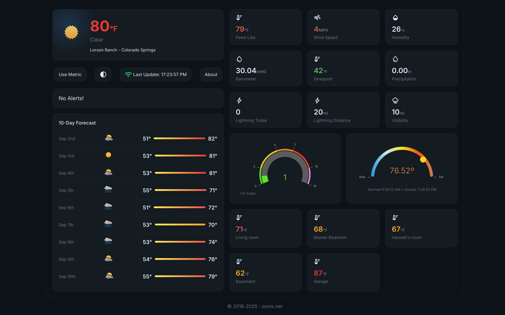

# Ambient Weather

This is a custom display for data from the Ambient Weather PWS  and requires an Ambient Weather Station. view live @ https://weather.zoms.net

# Setup

### Build Containers
 For each part of the appliction (server/transfer/ui) you will need to build the docker containers and push them to your own docker repository. You can use Dockerhub or any other repository you have access to. 
#### Build and Push UI Container
* docker build -t $DOCKER_REGISTRY/weather/weather-ui:v3.0.3 . --no-cache
* docker push $DOCKER_REGISTRY/weather/weather-ui:v3.0.3
#### Build and Push server Container
* docker build -t $DOCKER_REGISTRY/weather/weather-server:v4.0.1 . --no-cache
* docker push $DOCKER_REGISTRY/weather/weather-server:v4.0.1
#### Build and Push transfer Container 
* docker build -t $DOCKER_REGISTRY/weather/weather-transfer:2.1.2 . --no-cache
* docker push $DOCKER_REGISTRY/weather/weather-transfer:2.1.2

### Update Environment Variables
Update the environment variables in the file `docker-compose.yml` with your own values.

### PostgreSQL Setup
	
You will need to create a PostgreSQL database and user for the application. You can use any PostgreSQL instance you have access to. Update the environment variables in the file `docker-compose.yml` with your own values.
* Create a database named `ambient`
* Create a user named `ambient` with password of your choice
* Grant all privileges on the database `ambient` to the user `ambient`
* You can use pgAdmin or any other PostgreSQL client to create the database and user.
* Apply the schema.sql file to the database to create the necessary tables. You can use pgAdmin or any other PostgreSQL client to apply the schema.

### API KEYS
Api keys will need to be acquired for the following services and updated in the environment variables in the file `docker-compose.yml` with your own values.
- Virtual Crossing - https://www.visualcrossing.com/

### Setting data source
You will need to set the data source for the application. You can configure the data source in the Awnet application, you will point customized option to the ip addess of the computer that 
the weather-transfer container is running on. use the following values in the Awnet application.
* For Disable / Enable Data Push - Enable
* For the server IP / Hostname - IP address of the computer running the weather-transfer container
* For the path  - /api/receiver?
* For the port - 7500 or the port value you set in the environment variable TRANSFER_PORT in the docker-compose.yml file.
* For Upload Interval - enter the number of seconds you want the data to be pushed to the weather-transfer container. The default is 300 seconds (5 minutes). The lowest recommended value is 60 seconds.
* Click the save button and monitor the logs of the weather-transfer container to see if data is being received.

### Update Location Information 
You will need to update the location information in the environment variables in the file `docker-compose.yml` with your own values. As well 
you will need to update the longname, shortname, state and country in the Context.tsx file. 

# Starting the application

You can start the application using docker-compose. Run the following command in the directory where the `docker-compose.yml` file is located.
* Starting - docker-compose up -d
* Stopping - docker-compose down

# LICENSE
<!--
Copyright (c) 2019-2023 by Brian Paulson (https://weather.zoms.net) JS/SQL/HTML/CSS/SVG
-->
Permission is hereby granted, free of charge, to any person obtaining a copy of this software and associated documentation files (the “Template”), to deal in the Template without restriction, including without limitation the rights to, can use, can not copy without prior permission, can modify for personal use, can use and publish for personal use ,can not distribute without prior permission, can not sublicense without prior permission, and can not sell copies of the Template, and subject to the following conditions:

The above copyright notice and this permission notice shall be included in all copies or substantial portions of the Template.

THE TEMPLATE IS PROVIDED "AS IS", WITHOUT WARRANTY OF ANY KIND, EXPRESS OR IMPLIED, INCLUDING BUT NOT LIMITED TO THE WARRANTIES OF MERCHANTABILITY, FITNESS FOR A PARTICULAR PURPOSE AND NON INFRINGEMENT. IN NO EVENT SHALL THE AUTHORS OR COPYRIGHT HOLDERS BE LIABLE FOR ANY CLAIM, DAMAGES OR OTHER LIABILITY, WHETHER IN AN ACTION OF CONTRACT, TORT OR OTHERWISE, ARISING FROM, OUT OF OR IN CONNECTION WITH THE TEMPLATE OR THE USE OR OTHER DEALINGS IN THE TEMPLATE.